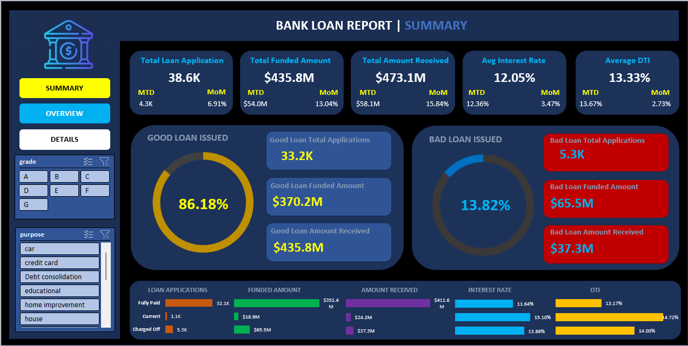

# 📊 Bank Loan Report Dashboard

## 📌 Project Overview
This project analyzes and visualizes **bank loan data** to monitor lending activities, assess portfolio health, and identify trends for data-driven decision-making.  
It consists of two interactive dashboards:
1. **Summary Dashboard** – focuses on Good Loan vs Bad Loan KPIs.
2. **Overview Dashboard** – shows monthly trends, regional breakdown, and borrower demographics.

---

## 💡 Project Scenario & Workflow
Before building the final dashboards in Excel, I first created **SQL-based queries** to:
- Clean and preprocess the dataset directly in **SQL Server**.
- Extract **aggregated and filtered insights** required for KPIs.
- Test different breakdowns (by month, state, purpose, term, etc.) before visualization.

**Workflow Steps:**
1. Imported the **Bank Loan Database** into SQL Server.
2. Wrote SQL queries to generate metrics and breakdowns for both dashboards.
3. Exported the query results into **Excel**.
4. Built final dashboards in Excel for visualization.

This approach ensured:
- **Accuracy** of aggregated data before visualization.
- **Faster dashboard building** since metrics were pre-calculated.
- **Data consistency** between different KPIs.

---

## 📂 Problem Statement
The goal is to create a **comprehensive Bank Loan Report** that:
- Tracks loan applications, funded amounts, and amounts received.
- Monitors MTD (Month-to-Date) and MoM (Month-over-Month) changes.
- Analyzes average interest rate and Debt-to-Income Ratio (DTI).
- Segregates loans into Good Loans and Bad Loans.
- Provides visual insights using multiple chart types.

📄 [Bank Loan Project Problem Statement & Dashboards Overview](https://drive.google.com/file/d/1Lyw6vaCC73AOuA_bLL3jmHMQDnnXMxLO/view?usp=sharing)

---

## 📚 Dataset Terminologies
A dedicated document explains all dataset fields — such as Loan ID, Loan Status, Purpose, Grade, Term, Annual Income, and DTI — to ensure clarity while building KPIs.

📄 [Terminologies Explained in Bank Loan Project's Dataset](https://drive.google.com/file/d/1yQRrjlv_UVth2iyHErhdqUiGS7qr8HYt/view?usp=sharing)

---

## 🗄 SQL Scripts
The SQL files used for data preparation:
- 📜 [Overview Dashboard SQL](https://github.com/zodrickjohn/Bank-Loan-Report/blob/main/bank%20loan%20%20-%20overview%20dashboard.sql)  
- 📜 [Summary Dashboard SQL](https://github.com/zodrickjohn/Bank-Loan-Report/blob/main/bank%20loan%20%20-%20summary%20dashboard.sql)

---

## 📊 Dashboards

### 1️⃣ Overview Dashboard
Shows:
- Monthly loan trends
- Regional loan distribution
- Loan term, employee length, purpose, and home ownership breakdowns

**Screenshot:**  

---

### 2️⃣ Summary Dashboard
Shows:
- Good Loan vs Bad Loan KPIs (percentage, count, funded amount, received amount)
- Loan status breakdown with interest rate & DTI

**Screenshot:**  

---

## 🛠 Tools & Technologies Used
- **SQL Server** – for data extraction, cleaning, and aggregation
- **Excel** – for final dashboard design and visualization
- **Power Query** – for minor transformations inside Excel

---

## 📈 Key KPIs Monitored
### Loan Portfolio Metrics
- Total Applications (MTD, MoM)
- Total Funded Amount (MTD, MoM)
- Total Amount Received (MTD, MoM)

### Financial Ratios
- Average Interest Rate (MTD, MoM)
- Average DTI (MTD, MoM)

### Performance Segmentation
- Good Loan % and Bad Loan %
- Funded/Received Amounts per loan category

---

## 📬 Author
**Zodrick John**  
UE223115

---
